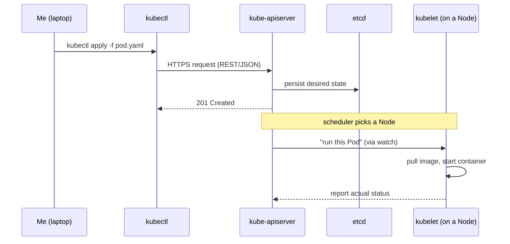
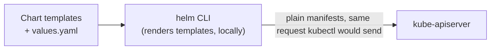
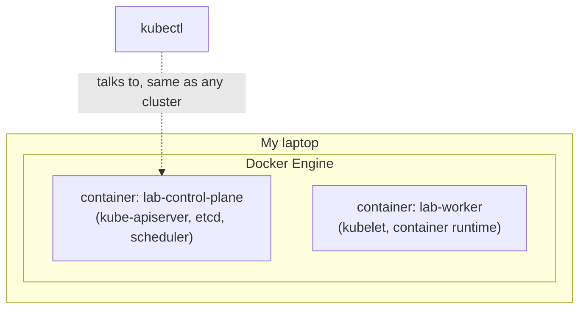
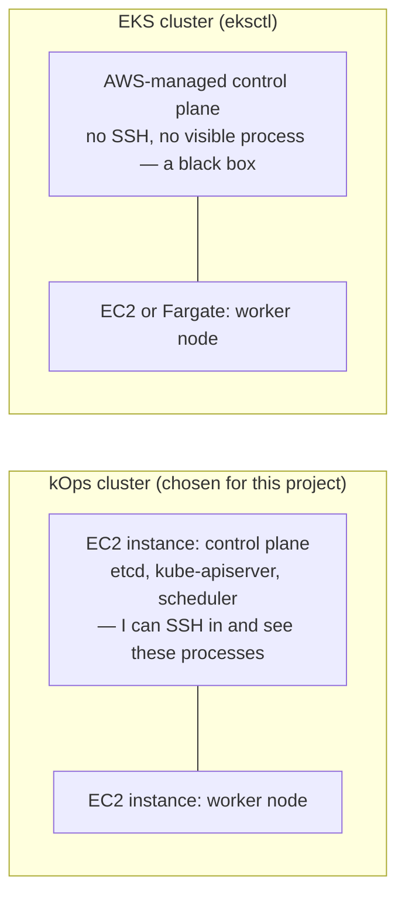
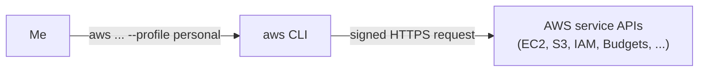

# Phase 00 — Tooling Reference

This is a reference for every CLI tool introduced so far, written as lecture notes rather than a how-to. The idea is to have one place that tracks *what I now understand*, not just what I ran. Later phases will add their own tool notes in their own folders (e.g. Linkerd in `docs/03-service-mesh/`, Terraform in `docs/05-eks/`) following the same format.

For each tool: what it is, what it actually does, and why it's part of this project specifically.

---

## kubectl

**What it is:** the standard command-line client for the Kubernetes API server. It is not tied to any specific cluster or cloud — it's a client for "the Kubernetes API" as a concept.

**What it does:** translates commands (or YAML manifests) into HTTPS requests against a cluster's API server, and renders the responses back into human-readable output. Every action a cluster takes — creating a Pod, reading logs, changing a Deployment — ultimately happens because something (a person, or another tool) sent a request through this same API.

**Where it actually runs — kubectl is 100% client-side:**

`kubectl` never touches a Node directly — it only ever talks to the API server. Everything after that (scheduling, actually starting a container) happens on the cluster side, driven by controllers reacting to the change `kubectl` just wrote into etcd.

**Why we're using it:** it's the one constant across the entire curriculum. The exact same `kubectl` binary talks to a local `kind` cluster, a self-managed `kOps` cluster on AWS, or a managed EKS cluster identically, because it only ever speaks to the Kubernetes API — never directly to the cloud provider. Every other tool in this project (Helm, ArgoCD, the mesh CLI) is, underneath, either wrapping `kubectl`'s job or talking to that same API directly.

---

## Helm

**What it is:** the de facto package manager for Kubernetes.

**What it does:** bundles a set of related Kubernetes manifests into a "chart" — templated YAML plus a values file — so the same chart can be installed differently across environments (dev vs prod, small vs large) by changing values instead of duplicating YAML by hand. It also tracks what it installed as a "release," so it can upgrade or roll that release back as a unit.

**Where it actually runs — no separate server, unlike old Helm v2:**

Helm v3 (what we use) has no "Tiller" server component living in the cluster — the CLI renders everything on your machine and then talks to the API server exactly the way `kubectl apply` would.

**Why we're using it:** almost nothing gets installed by hand-writing YAML in a real cluster. Ingress controllers, the AWS Load Balancer Controller, Prometheus, Linkerd or Istio, cert-manager — the standard practice everywhere is to install these via a published Helm chart. Being fluent with Helm (installing a chart, overriding its values, upgrading a release) is assumed baseline knowledge in almost any Kubernetes-related work, so it's introduced now rather than later.

---

## kind (Kubernetes IN Docker)

**What it is:** a tool that runs a real, fully-featured Kubernetes cluster using Docker containers as the cluster's "nodes" — not virtual machines, not cloud infrastructure.

**What it does:** starts one or more containers, each running actual Kubernetes control-plane and node components inside it, and wires them together into a genuine multi-node-capable cluster entirely on a laptop.

**Where it actually runs — nodes are just containers:**

Nothing here is virtualized beyond Docker itself — "the cluster" is just a couple of specially-configured containers on the same machine `kubectl` is running on.

**Why we're using it:** it's free, disposable, and fast to tear down and recreate — exactly what's needed for the fundamentals, networking, service mesh, and GitOps phases, where the goal is understanding Kubernetes concepts, not cloud infrastructure. It's also worth knowing this isn't a toy: `kind` is literally what the upstream Kubernetes project and most CI systems use to test real changes against a real cluster.

---

## kOps (Kubernetes Operations)

**What it is:** a cluster lifecycle tool that provisions a genuine, self-managed Kubernetes cluster directly on top of raw cloud infrastructure — in this project, AWS EC2 — rather than using a managed Kubernetes service.

**What it does:** given a cluster specification, it creates the underlying cloud resources (networking, EC2 instances, security groups, an S3-backed state store recording the cluster's config) and installs and configures the actual Kubernetes control-plane components — etcd, the API server, the scheduler, the controller manager — directly onto those instances. It can also apply later changes to a running cluster or roll nodes for an upgrade.

**Why we're using it:** the explicit goal for the cloud phase of this project is to *see* the control plane, not have it hidden behind a managed service. kOps is what makes that possible on AWS — once a cluster exists, its control-plane instance can be inspected directly, with etcd and the API server running as real, ordinary Linux processes rather than an invisible AWS-managed black box.

---

## eksctl (introduced, not the primary path)

**What it is:** AWS's own command-line tool for creating and managing EKS clusters — Elastic Kubernetes Service, AWS's managed Kubernetes offering.

**What it does:** wraps the AWS APIs needed to stand up an EKS cluster — networking, IAM roles, the managed control plane, and worker node groups — behind a small number of commands, largely built on CloudFormation underneath.

**Where the control plane actually runs — kOps vs EKS, side by side:**

Same job, opposite trade: kOps trades AWS's operational convenience for the ability to actually see how a control plane works — which is the whole reason it's the primary tool here.

**Why it's mentioned at all, despite not being the primary tool here:** EKS is what most companies actually run in production. This project deliberately chooses kOps first, to learn what a managed service like EKS is normally hiding. `eksctl`/EKS is still worth trying once, later, purely to recognize that managed experience — since it's the one most likely to show up in an actual job.

---

## AWS CLI (`aws`)

**What it is:** the general-purpose command-line interface for every AWS service. It has nothing to do with Kubernetes specifically.

**What it does:** sends authenticated requests to AWS's APIs — creating an S3 bucket, checking which identity is currently authenticated, reading budget or cost data, or anything else AWS exposes — using credentials stored under a named profile (`personal`, in this project).

**Where it actually runs — a completely separate path from kubectl:**

No overlap with the kubectl diagram above — this never touches the Kubernetes API at all. kOps happens to call both: it uses the `aws` credentials to create the EC2 instances, then hands off to `kubectl`/the Kubernetes API once the cluster is actually up.

**Why we're using it:** it's the foundation everything AWS-related sits on. kOps calls AWS's APIs on my behalf using these same credentials; the AWS Budget and billing alarm live entirely inside AWS, outside Kubernetes entirely; and confirming identity (checking which account and user the `personal` profile resolves to) was how the profile got verified before trusting it with anything that could incur cost.
